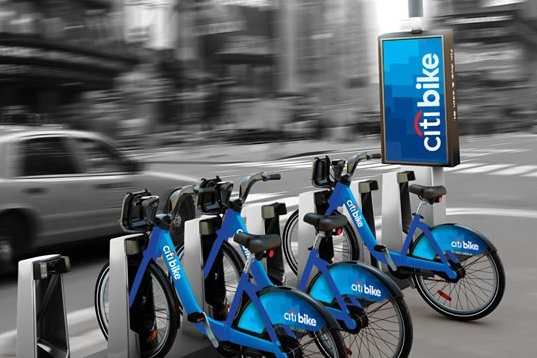
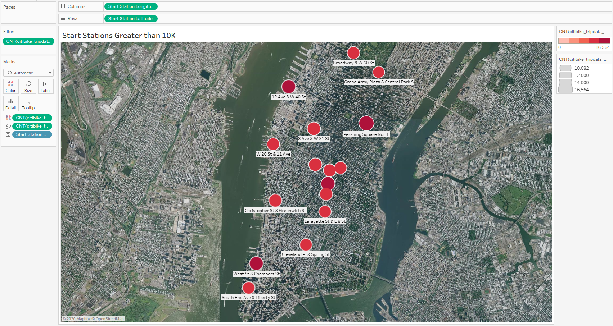
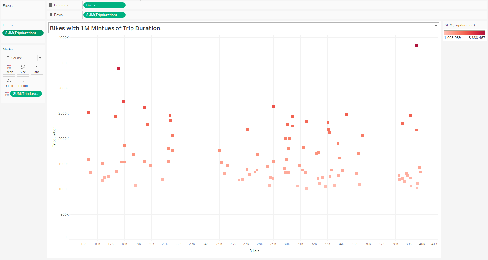

# NYC Citibike Bikesharing

## Project Overview

Using the NYC Citibike bike-sharing data from August 2019 to build a proposal to convince investors that a bike-sharing is a solid business idea. The data was customized using Pandas and imported into Tableau Public to create multiple worksheets breaking down the data. A story was then created to show the trends in the data.

## Resources

- Data Source: citibike_tripdata_201908.csv
- Software: Visual Code Studio 1.51, Atom 1.52.0 x64, Tableau Public

## Results

There are seven visualizations created from the data in Tableau.

1. Checkout Times by Users

- This line graph shows the number of bikes checked out by riders in each hour. The results show that between 4am - 7am the highest volume of bikes are checked out.

2. Checkout Time by Gender

- This line graph breaks down the bikes checked out by gender over each hour in a 24 hour period. The results show a significant difference between male and female rides. There are 75% more male riders checking out bikes and the peak hour of 5am. This drops to 60% by 12 noon and the gap narrows even further as the day goes on and into the evening.

3. Trips by Weekday hour

- This heatmap shows the times that there are higher and lower volumes of trips being made. The results are that between 7am - 9am and 5pm - 7pm and the highest volumes and that between 12am - 4am are the lowest volumes.

4. August Peak Hours

- This bar graph gives a different view of the peak times for rides. The result is that there were near 225,000 rides at 5pm in the month of August and 170,000 at 8am.

5. Trips by Gender During the Week by Hours

- This heatmap breaks down the trips made on each day of the week by hour and by gender. The results are that males account for more volume and that the peak time are between 7am - 9am and 5pm - 7pm.

6. Trips by Gender by Weekday Split by User Type

- This heat map breaks down the volume of rides for each day of the week by gender and by user type. The results are that male subscribers have the highest volumes on Thursday and Friday and the lowest volumes are female customers, Monday - Friday.

7. Top Starting Locations

- The map shows the locations geographically that have the most and least amount of starting point based on colour and size. The results and that higher volumes of bike start from around Central Park and the Lincoln Tunnel.

## Summary

In summary, the following was following conclusions were made by visualizing the data:

- The highest volumes for bike checkouts were between 4am - 6am.
- Males checkout a significantly higher volume of bikes than females.
- The peak hours for the highest volume of trips is between 7am - 9am and 5pm - 7pm, Monday - Friday and 12pm - 4pm, Saturday - Sunday.
- Males are higher in volume for trips yet the times that the highest volumes take place are the same for male and female.
- The highest volumes of trips are by males that are subscribers between Monday - Friday with Thursday being the peak day.

Two additional visualizations that I would perform with the dataset would be as follows:

1. First, I would continue with the idea of showing the top starting locations on a map except now adding the start station label as well as filtering the data to only show stations with greater than 9,999. See image bellow.

2. Second, I would create a chart to isolate the bikes that have a million or greater minutes of use so that they could be looked at for repairs or replacement. This can be accomplished by adding the BikeId to the Columns and the sum of Tripduration to the Rows. I added the sum of Tripduration to the colour marks and the filters and filtered out anything bellow one million. See image bellow.

# Tableau Public

[Click Link to Open Tableau Public Page]("https://public.tableau.com/views/NYCCitibikeBikesharing/NYCStory?:language=en&:display_count=y&publish=yes&:origin=viz_share_link")
